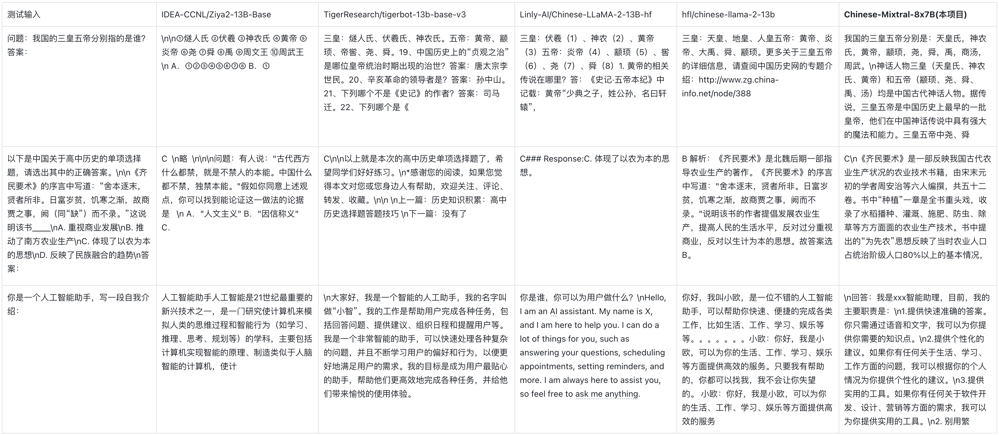
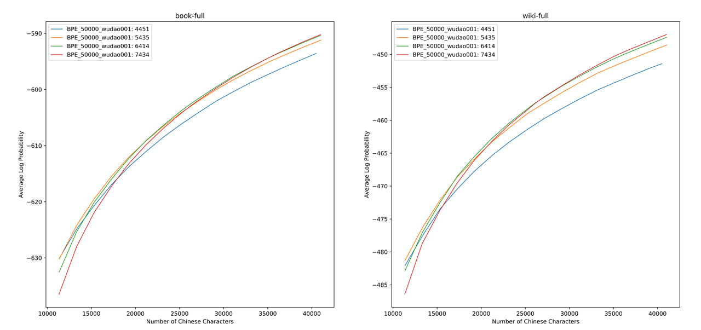

<div align="center">
    <h1>
        Chinese-Mixtral-8x7B
    </h1>
</div>


<div align="center">
    <a href="https://github.com/HIT-SCIR/Chinese-Mixtral-8x7B/pulls">
        <image src="https://img.shields.io/badge/PRs-welcome-brightgreen"></image>
        <image src="https://img.shields.io/badge/License-Apache_2.0-green.svg"></image>
    </a>
</div>

## 🎉 新闻

- [2024-02-09] 发布基于Chinese-Mixtral-8x7B指令微调的模型：[活字 3.0](https://github.com/HIT-SCIR/huozi)；开源指令微调代码。
- [2024-01-18] 发布Chinese-Mixtral-8x7B基座模型；开源增量预训练代码。

## 🚀 介绍

本项目基于Mistral发布的模型[Mixtral-8x7B](https://mistral.ai/news/mixtral-of-experts/)进行了中文扩词表增量预训练，希望进一步促进中文自然语言处理社区对MoE模型的研究。我们扩充后的词表显著提高了模型对中文的编解码效率，并通过大规模开源语料对扩词表模型进行增量预训练，使模型具备了强大的中文生成和理解能力。

项目开源内容：

- 中文Mixtral-8x7B扩词表大模型
- 扩词表增量预训练代码

> 请注意，Chinese-Mixtral-8x7B仍然可能生成包含事实性错误的误导性回复或包含偏见/歧视的有害内容，请谨慎鉴别和使用生成的内容，请勿将生成的有害内容传播至互联网。

## 📥 模型下载

本项目使用QLoRA进行训练，LoRA权重与合并权重后的模型分别开源，您可以根据自己的需求选择下载：

|             模型名称             | 模型大小  |                                     下载地址                                      |                                                         备注                                                          |
|:----------------------------:|:-----:|:-----------------------------------------------------------------------------:|:-------------------------------------------------------------------------------------------------------------------:|
|     Chinese-Mixtral-8x7B     | 88GB  |     [HuggingFace](https://huggingface.co/HIT-SCIR/Chinese-Mixtral-8x7B)<br>[ModelScope](https://modelscope.cn/models/HIT-SCIR/Chinese-Mixtral-8x7B/summary)     |                                                  中文扩词表完整模型，可以直接使用                                                   |
| Chinese-Mixtral-8x7B-adapter | 2.7GB | [HuggingFace](https://huggingface.co/HIT-SCIR/Chinese-Mixtral-8x7B-adapter) | LoRA权重，需要与原版Mixtral-8x7B进行合并才可以使用，合并脚本请参考[这里](https://gist.github.com/ChrisHayduk/1a53463331f52dca205e55982baf9930) |

## 💻 模型推理

Chinese-Mixtral-8x7B支持完整的Mixtral-8x7B模型生态，包括使用`vLLM`、`Flash Attention 2`进行加速，使用`bitsandbytes`进行模型量化等。以下是使用Chinese-Mixtral-8x7B进行推理的代码示例。

使用Flash Attention 2：
```python
import torch
from transformers import AutoModelForCausalLM, AutoTokenizer

model_id = "HIT-SCIR/Chinese-Mixtral-8x7B"
tokenizer = AutoTokenizer.from_pretrained(model_id)

model = AutoModelForCausalLM.from_pretrained(model_id, attn_implementation="flash_attention_2", torch_dtype=torch.bfloat16, device_map="auto")

text = "我的名字是"
inputs = tokenizer(text, return_tensors="pt").to(0)

outputs = model.generate(**inputs, max_new_tokens=20)
print(tokenizer.decode(outputs[0], skip_special_tokens=True))
```

使用4bit量化：
```python
import torch
from transformers import AutoModelForCausalLM, AutoTokenizer

model_id = "HIT-SCIR/Chinese-Mixtral-8x7B"
tokenizer = AutoTokenizer.from_pretrained(model_id)

model = AutoModelForCausalLM.from_pretrained(model_id, load_in_4bit=True, device_map="auto")

text = "我的名字是"
inputs = tokenizer(text, return_tensors="pt").to(0)

outputs = model.generate(**inputs, max_new_tokens=20)
print(tokenizer.decode(outputs[0], skip_special_tokens=True))
```

请注意，Chinese-Mixtral-8x7B为基座模型，没有经过指令微调，因此指令遵循能力有限。您可以参考[微调](#微调)一节对模型进行微调。

## 📈 模型性能

### 模型综合能力

我们分别使用以下评测数据集对Chinese-Mixtral-8x7B进行评测：

- C-Eval：一个全面的中文基础模型评估套件。它包含了13948个多项选择题，涵盖了52个不同的学科和四个难度级别。
- CMMLU：一个综合性的中文评估基准，专门用于评估语言模型在中文语境下的知识和推理能力，涵盖了从基础学科到高级专业水平的67个主题。
- MMLU：一个包含57个多选任务的英文评测数据集，涵盖了初等数学、美国历史、计算机科学、法律等，难度覆盖高中水平到专家水平，是目前主流的LLM评测数据集之一。
- HellaSwag：一个极具挑战的英文NLI评测数据集，每一个问题都需要对上下文进行深入理解，而不能基于常识进行回答。

根据Mistral发布的[技术报告](https://arxiv.org/pdf/2401.04088.pdf)，Mixtral-8x7B在推理时将激活13B参数。下表为Chinese-Mixtral-8x7B与其他13B规模的中文扩词表模型在各个评测数据集上的5-shot结果：

|                                              模型名称                                               |      增量训练语料       | C-Eval<br>(中文) | CMMLU<br>(中文) | MMLU<br>(英文) | HellaSwag<br>(英文) |
|:-----------------------------------------------------------------------------------------------:|:-----------------:|:--------------:|:-------------:|:------------:|:-----------------:|
|           [IDEA-CCNL/Ziya2-13B-Base](https://huggingface.co/IDEA-CCNL/Ziya2-13B-Base)           |    650B Token     |     59.29      |     60.93     |    59.86     |       58.90       |
| [TigerResearch/tigerbot-13b-base-v3](https://huggingface.co/TigerResearch/tigerbot-13b-base-v3) |    500B Token     |     50.52      |     51.65     |    53.46     |       59.16       |
|    [Linly-AI/Chinese-LLaMA-2-13B-hf](https://huggingface.co/Linly-AI/Chinese-LLaMA-2-13B-hf)    |     11B Token     |     42.57      |     41.95     |    51.32     |       59.05       |
|            [hfl/chinese-llama-2-13b](https://huggingface.co/hfl/chinese-llama-2-13b)            | 约30B Token(120GB) |     41.90      |     42.08     |    51.92     |       59.28       |
|                                  **Chinese-Mixtral-8x7B(本项目)**                                  |     42B Token     |     52.08      |     51.08     |    69.80     |       65.69       |

在中文知识和理解方面，我们的Chinese-Mixtral-8x7B与TigerBot-13B-Base-v3性能相当。由于Chinese-Mixtral-8x7B的训练数据量仅为TigerBot-13B-Base-v3的8%，我们的模型仍有进一步提升的空间。与此同时，得益于原版Mixtral-8x7B模型强大的性能，我们的Chinese-Mixtral-8x7B达到了各个扩词表模型的最强英文水平。

> 由于不同版本的评测脚本实现细节有细微差异，为了保证评测结果的一致性和公平性，我们的评测脚本统一使用EleutherAI发布的lm-evaluation-harness，commit hash为[28ec7fa](https://github.com/EleutherAI/lm-evaluation-harness/tree/28ec7fa950346b5a895e85e1f3edd5648168acc4)。

### 模型生成效果

下表为各个扩词表模型的生成效果。由于部分模型的预训练语料未使用`eos_token`进行分隔，我们采用了`max_tokens = 100`对生成文本进行截断。我们的采样参数为`temperature = 0.8, top_p = 0.9`。



### 中文编解码效率

针对中文编解码效率，我们使用各个扩词表模型的分词器对[SkyPile](https://huggingface.co/datasets/Skywork/SkyPile-150B)数据集的一个切片（2023-06_zh_head_0000.jsonl）进行编码，对比了各个分词器输出的中文文本Token量：

|                模型名称                |  模型类别   | 词表大小  | 中文文本Token量 | 编解码效率 |
|:----------------------------------:|:-------:|:-----:|:----------:|:-------:|
|     meta-llama/Llama-2-13B-hf      |  LLaMA  | 32000 |    780M    |    低    |
|    mistralai/Mixtral-8x7B-v0.1     | Mixtral | 32000 |    606M    |    低    |
|  Linly-AI/Chinese-LLaMA-2-13B-hf   |  LLaMA  | 40076 |    532M    |  中  |
|      IDEA-CCNL/Ziya2-13B-Base      |  LLaMA  | 39424 |    532M    |  中  |
|      hfl/chinese-llama-2-13b       |  LLaMA  | 55296 |    365M    |  高  |、
| TigerResearch/tigerbot-13b-base-v3 |  LLaMA  | 65112 |    342M    |  高  |
|   **Chinese-Mixtral-8x7B(本项目)**    | Mixtral | 57000 |    355M    |  高  |

在约1.4GB的测试文本中，我们的Chinese-Mixtral-8x7B中文编解码效率仅次于TigerBot-13B-Base-v3，较原模型提高了41.5%。这有利于加速中文文本的推理速度，并在In-Context Learning、Chain-of-Thought等场景中节省序列长度，有利于提高复杂推理任务的性能。

## ⚙️ 训练细节

<details>
<summary>

### 词表扩充

</summary>

我们使用`sentencepiece`在12G知乎数据和2G悟道数据上训练中文BPE词表。我们在训练词表时分别枚举了中文单字Token数量以及中文总Token数量，并对二者进行组合，得到了数百个大小、内容各异的词表。为了得到最适合的词表，我们通过Zheng Bo等人提出的[ALP](https://arxiv.org/pdf/2109.07306.pdf)计算这些词表的中文词汇能力。ALP通过计算特定语言的子词切分粒度，并对词表的中低频子词进行惩罚，是一种方便快捷的衡量特定语言词汇能力的指标。

我们在书籍和百科语料上评估了不同词表的ALP值。图示中，四条曲线分别代表四种中文单字Token数量的词表（4451、5435、6414和7434）。为了避免词表过小导致中文压缩率过低，以及词表过大导致embedding层过于稀疏，我们选取ALP曲线的拐点，对应向词表中新增25000个中文Token。在此基础上，我们选择了四条曲线中ALP最大者，即新增6414个中文单字Token的词表，作为最终Chinese-Mixtral-8x7B选用的词表。



在获得新词表后，我们需要对embedding和lm_head层进行扩充和初始化。我们使用新Token在旧embedding层中的词嵌入平均值对扩充部分进行初始化。在我们的前期实验中，这种方法略优于HuggingFace的默认实现，即使用固定的正态分布进行初始化。

</details>

<details>
<summary>

### 增量预训练

</summary>

Mixtral-8x7B模型参数量为46.7B，全参数训练需要同时使用多种并行策略，在训练资源受限的情况下时间成本过高。因此我们采用HuggingFace官方推荐的方法，使用QLoRA对模型进行训练。QLoRA在LoRA低秩分解的基础上，通过引入4位量化、双重量化和利用NVIDIA统一内存进行分页，进一步减少了训练所需显存，同时保持了与全参数训练相当的性能。

我们参考Yiming Cui等人[对LoRA的设置](https://github.com/ymcui/Chinese-LLaMA-Alpaca-2/blob/main/scripts/training/run_pt.sh)，对原模型所有Linear层应用低秩分解，并将扩增后的embedding和lm_head层的参数设置为可训练。对于模型主体，我们采用NF4格式进行量化，这种格式可以使得量化后的数据与量化前具有同等的数据分布，模型的权重信息损失更少。

#### 环境准备

我们建议使用Python 3.10 + torch 2.0.1

```shell
# Pytorch + Transformers
$ pip install torch==2.0.1 torchvision==0.15.2 torchaudio==2.0.2
$ pip install transformers==4.36.2 datasets evaluate peft accelerate gradio optimum sentencepiece trl
$ pip install jupyterlab scikit-learn pandas matplotlib tensorboard nltk rouge bitsandbytes fire
# CUDA Toolkit
$ conda install nvidia/label/cuda-11.7.1::cuda
# DeepSpeed
$ git clone https://github.com/microsoft/DeepSpeed.git
$ cd DeepSpeed
$ DS_BUILD_FUSED_ADAM=1 pip3 install .
# Flash Attention
$ pip install flash-attn --no-build-isolation
```

#### 数据集下载

我们基于现有的开源数据集训练了Chinese-Mixtral-8x7B，数据集包括：

|                                    数据集名称                                     | 数据集语言 |使用数据量|        备注        |
|:----------------------------------------------------------------------------:|:-----:|:----------------:|:-----:|
| [Skywork/SkyPile-150B](https://huggingface.co/datasets/Skywork/SkyPile-150B) |  中文   |30B| 仅使用2022 + 2023年的数据 |
| [DKYoon/SlimPajama-6B](https://huggingface.co/datasets/DKYoon/SlimPajama-6B) |  英文   |12B|        数据集重复2 Epoch         |

通过`data/download.py`将数据集下载到`data`中。针对Slimpajama数据集，需要使用`data/parquet2jsonl.py`将原始数据集转换为`jsonl`格式。

下载后的数据集为多个jsonl文件的分片，使用`cat`将多个分片合并为一个jsonl文件。

```shell
$ cat *.jsonl > all.jsonl
```

通过`split`将jsonl切分为train和valid集合。本项目中train和valid的行数比例为999:1。

```shell
$ wc -l all.jsonl                          # 计算数据集总行数
$ split -l <lines> all.jsonl               # 按999:1计算train/valid行数，进行切分
$ mv xaa DKYoon-SlimPajama-6B-train.jsonl  # 重命名
$ mv xab DKYoon-SlimPajama-6B-dev.jsonl
```

#### 数据集预处理

将数据集名称和路径注册到`data/datasets.toml`中：

```toml
[DKYoon-SlimPajama-6B]              # 数据集名称
splits = ["train", "dev"]           # 数据集train/valid集合
root = "{DATA_DIR}/en/{name}"       # 数据集根目录
doc = "{name}-{split}"              # 数据集文件名
encoded = "encoded-{name}-{split}"  # 预处理保存位置
```

使用`data/preprocess_datasets.py`对数据集进行子词切分，从而加快训练速度。

```shell
$ python data/preprocess_datasets.py --ds_name SkyPile-150B-2023 --tokenizer_name_or_path tokenizer/Mixtral-8x7B-v0.1-vocab
$ python data/preprocess_datasets.py --ds_name DKYoon-SlimPajama-6B --tokenizer_name_or_path tokenizer/Mixtral-8x7B-v0.1-vocab
```

在进行子词切分后，可以使用`data/utils.py`查看各个数据集的token总量：

```shell
$ python data/utils.py
```

#### 开始训练

训练启动脚本为`scripts/train.sh`。可以通过修改其中的`TRAIN_DATASETS`修改训练数据集和数据集比例：

```shell
TRAIN_DATASETS=(
    1:SkyPile-150B-2022     # 使用全量SkyPile-150B-2022
    0.1:SkyPile-150B-2023   # 使用SkyPile-150B-2023的10%数据
    1:DKYoon-SlimPajama-6B  # 使用全量DKYoon-SlimPajama-6B
)
```

如果您使用SLURM集群管理系统，可以通过`sbatch`进行提交：

```shell
$ sbatch scripts/train-pt.sh
```

如果没有SLURM或希望通过命令行启动训练，您可以直接提取`scripts/train-pt.sh`中的`torchrun`开始训练。

</details>

<details>
<summary>

### 微调

</summary>

#### 数据集准备

微调需要的数据集格式与预训练类似，数据集文件需要为jsonl格式：每行一个json，其中需要包含`"text"`字段，将instruction、input和output全部按照您需要的模板进行拼接。

然后需要将数据集名称和路径注册到`data/datasets.toml`中：

```toml
[ShareGPT-Chinese]              # 数据集名称
splits = ["train"]              # 数据集train/valid集合
root = "{DATA_DIR}/sft/{name}"  # 数据集根目录
doc = "{name}-{split}"          # 数据集文件名
```

#### 开始训练

训练启动脚本为`scripts/train-sft.sh`。可以通过修改其中的`TRAIN_DATASETS`修改训练数据集和数据集比例：

```shell
TRAIN_DATASETS=(
    1.0:ShareGPT-Chinese  # 使用全量ShareGPT-Chinese
    0.5:ShareGPT-English  # 使用ShareGPT-English的50%数据
)
```

如果您使用SLURM集群管理系统，可以通过`sbatch`进行提交：

```shell
$ sbatch scripts/train-sft.sh
```

如果没有SLURM或希望通过命令行启动训练，您可以直接提取`scripts/train-sft.sh`中的`torchrun`开始训练。

</details>

## ✒️ 引用

如果您觉得本项目对您的研究有所帮助或使用了本项目的代码，请引用本项目：

```bibtex
@misc{Chinese-Mixtral-8x7B,
    author = {HIT-SCIR},
    title = {Chinese-Mixtral-8x7B: An Open-Source Mixture-of-Experts LLM},
    year = {2024},
    publisher = {GitHub},
    journal = {GitHub repository},
    howpublished = {\url{https://github.com/HIT-SCIR/Chinese-Mixtral-8x7B}}
}
```

## 🌟 Star History

[](https://star-history.com/#HIT-SCIR/Chinese-Mixtral-8x7B&Date)
